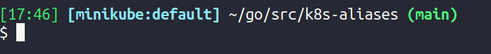

# k8s-aliases
Aliases and helpers to make the work in kubernetes environment easier.

## Prerequisites

Name    | Description       
------- | ------
[kubectl](https://kubernetes.io/docs/tasks/tools/) | The Kubernetes command-line tool that allows you to run commands against Kubernetes clusters. 
[kubectx](https://github.com/ahmetb/kubectx) | Tool to switch between contexts (clusters) on kubectl faster
[kubens](https://github.com/ahmetb/kubectx) | Tool to switch between Kubernetes namespaces (and configure them for kubectl) easily


## Installation and Usage


### Kubernetes commands aliases

To use my kubernetes commands aliases in your daily work with kubernetes, you have to copy the content of file `k8s-commands-aliases` into your `.bashrc` file.

```
$ git clone https://github.com/josericardomcastro/k8s-aliases
$ cd k8s-aliases
$ cat k8s-commands-aliases >> ~/.bashrc
$ source ~/.bashrc
```

#### The logic behind the aliases

Tools:
- `k` - kubectl
- `kx` - kubectx
- `kns` - kubens

Commands:
- `g` - get
- `e` - edit
- `d` - delete
- `desc` - describe

Resources:
- `n` - nodes
- `ns` - namespaces
- `p` - pods
- `dp` - deployments
- `ds` - daemonsets
- `rs` - replicasets
- `s` - services
- `i` - ingress
- `r` - routes
- `pvc` - persistentvolumeclaims
- `pv` - persistentvolume

#### Command usage example:

Alias | Command description
------ | ------------------- 
kx minikube | Switch to the minikube cluster
kns app-prod | Switch to app-prod namespace
kgp | kubectl get pods
kgpw | kubectl get pods -o wide
kgs | kubectl get services
kedp app-frontend | kubectl edit deployments app-frontend
kdns ns-test | kubectl delete namespaces ns-test

See the [k8s-commands-aliases](./k8s-commands-aliases) file to the full list of aliases.


### Custom PS1 Prompt for bash

Custom $PS1 (Prompt Statement One) with information about kubernetes and git.

The same way you did for the kubernetes aliases, you have to copy the content of file `k8s-git-ps1` into your `.bashrc` file.

```
$ cat k8s-git-ps1 >> ~/.bashrc
$ source ~/.bashrc
```

You will see a prompt like this:



Format: [current time] [k8s context : k8s namespace] ~current location (git branch name)